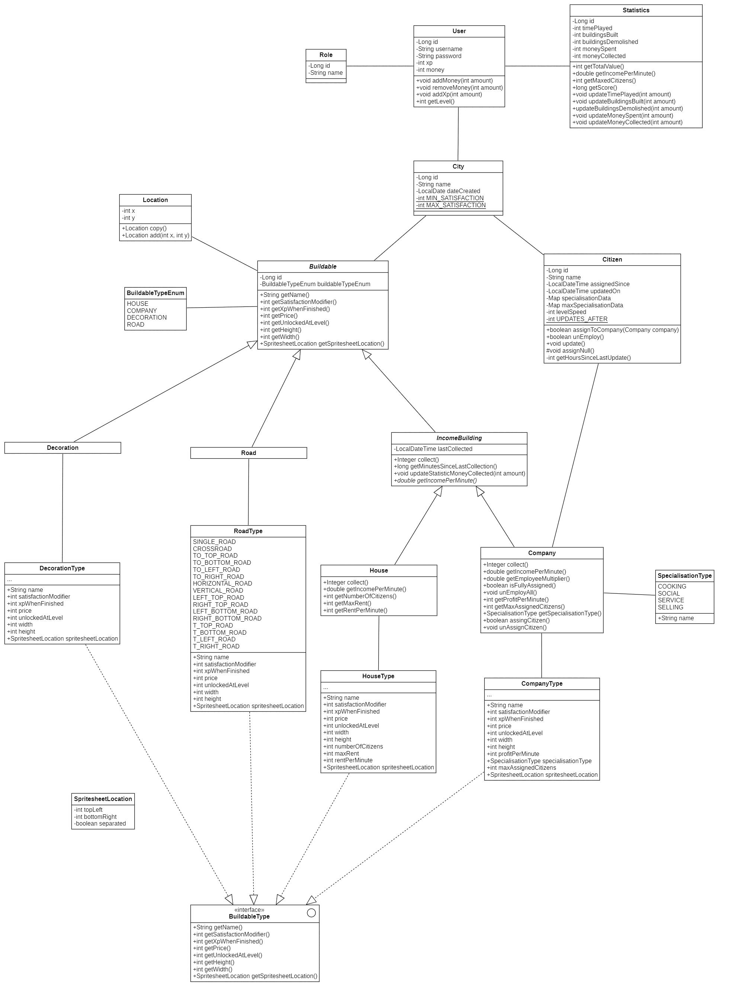
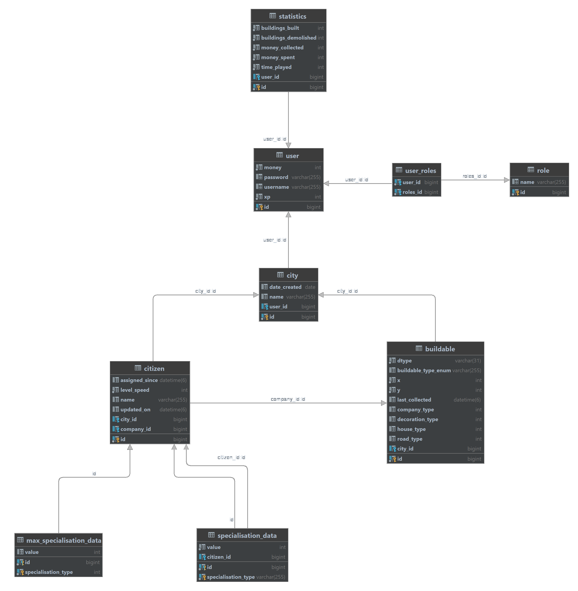

# Pokemon City API

Hello and welcome to the documentation of the Pokemon City API. This is the back end service that enables you to play the wonderful browser game Pokemon City. In this documentation, I will bring you along the way of the development process of the API.

## What is Pokemon City

Pokemon City is a city builder game. The goal of the game is to become the richest city owner, and develop your city as far as possible. It's a creative game because everyone can design his/her city as wanted.

To understand the logic that happens in the API, I really encourage you to read the [game mechanics document](./documentation/markdown/game-mechanics.md). This will give you a clearer insight on what happens behind the scenes in the API.

## Endpoints

The endpoints of the API are listed in the following table, if you want to see a more detailed information about this endpoint, open the png generated with Swagger.

|||
|---|---|
|__Admin__||
|GET|/api/admin/users|
|[Details](./documentation/images/admin.png)|
|ㅤ|
|__Auth__||
|GET|/auth/refreshToken|
|POST|/auth/login|
|POST|/auth/register|
|[Details](./documentation/images/auth.png)|
|ㅤ|
|__Buildable__||
|GET|/api/buildables|
|GET|/api/buildables/{id}|
|GET|/api/buildables/data|
|GET|/api/buildables/fromUser/{id}|
|POST|/api/buildables/build|
|PUT|/api/buildables/move|
|DELETE|/api/buildables/demolish|
|[Details](./documentation/images/buildable.png)|
|ㅤ|
|__Citizen__||
|GET|/api/citizens|
|GET|/api/citizens/unAssigned|
|PUT|/api/citizens/assign|
|PUT|/api/citizens/unAssign/{id}|
|[Details](./documentation/images/citizen.png)|
|ㅤ|
|__City__||
|POST|/api/city/changeName|
|[Details](./documentation/images/city.png)|
|ㅤ|
|__Company__||
|GET|/api/companies|
|[Details](./documentation/images/company.png)|
|ㅤ|
|__Income Building__||
|GET|/api/incomeBuildings/collectRent/{id}|
|[Details](./documentation/images/income-png.pdf)|
|ㅤ|
|__Road__||
|GET|/api/roads|
|POST|/api/roads/buildRoad|
|[Details](./documentation/images/road.png)|
|ㅤ|
|__User__||
|GET|/api/users/{id}|
|GET|/api/users/filter|
|GET|/api/users/me|
|GET|/api/users/ranking|
|POST|/api/users/me/updateStatistics|
|[Details](./documentation/images/user.png)|

## Process of creating Pokemon City

1. Brainstorm

    I did a short 10 minute brainstorm and structured the info that I found there. You'll see that in the end, a lot of these ideas would not be implemented.

    The brainstorm can be found [here](./documentation/markdown/brainstorm.md).

2. Deeper analysis

    I created a document and really started to think about all the functionalities of the game. In this document I wrote down the objects of which my game would exist and worked them out in detail.

    The document can be found [here](./documentation/markdown/analysis.md).

3. Creating class diagram

    From the analysis, I needed to create a class diagram to further design my program. Creating a class diagram makes you think ever more further about your application. This is the class diagram that I used to program the application (Click the diagram to see it bigger).

    
    
4. Data model

    Now, there were decisions to be made concerning persisting of data. For this purpose I created an ERD. In this data model you can see that I opted to save all types of buildables in one single table. This meant using the 'single_table' of the Java persistence api. Here you can see the ERD that I designed (Click the model to see it bigger).

    
    
5. Choosing the technology

    To choose the technology in which technology I wanted to create the application, there were a few requirements:
    - Widely used technology in Belgium (since I want to find a job in Belgium)
    - Knowledge of the basics, but still topics to learn during this project
    - Object Oriented language

    The possible candidates were Express.js (with TypeScript), C# (ASP.NET), PHP Laravel, Java Spring Boot. While having a bit of experience in both C# and PHP, I concluded these languages where not my thing. Since we already used express during the classes of web server programming, I chose Java with Spring Boot.

    This is the language I'm the most comfortable with, and the one I'm the most experienced in. Security with JWT's and input validation where something completely new for me, so I still had to learn new concepts nevertheless.

    I also chose of a relational database since this is pairs the best with JPA I feel. The database implementation didn't really matter for me because JPA abstracts out most of the database interaction.

6. Learning the new topics

    Security and input validation where one of the requirements of the research assignment, so I needed to learn them first. I participated in an [interactive YouTube tutorial about Spring Security with JWT's](https://www.youtube.com/watch?v=her_7pa0vrg&t=13644s&ab_channel=Amigoscode). This was a quite long video, but very clear and informative.

    After that, I followed two Bealdung tutorials about Spring Validation. The [first one](https://www.baeldung.com/spring-boot-bean-validation) was an introduction about pre-defined validation annotations. The [second one](https://www.baeldung.com/spring-mvc-custom-validator) gave me a more deep insight on how to write your own custom validator, which happened to be very useful in writing the API.

7. Setting up the project

    Before starting to code, the project needed to be created. I wanted to keep the project as professional as possible, and therefore tried to follow best practises regarding folder structure, DTO's, polymorphism and services.

8. Code the API

    The programming went quite smoothly in general. There were only two problems that needed a solution

    - Deprecated security component
        
        An update in Spring Boot last year deprecated the 'WebSecurityConfigurerAdapter'. This change was so recent that there was not so much information on the internet on how to update your code in a way following the Spring Boot standards. Luckily, I found an easy solution for this problem and could continue with the development.

    - How to efficiently manage type specific data

        I did some basic game development earlier in my carrier, where I stumbled upon the same problem and did not find a solution for this. The problem that occurs is 'where to store data related to all objects of a type efficiently, while keeping classes easy to refactor?'

        - Subclass each different type

            This was a really bad solution for me because it would result in a bunch of subclasses that just have different values of their attributes.

        - Save the data in the database

            I could opt for persisting this data in the database and saving the reference to the type in each object. This is not a bad solution, but would result in a bunch of database queries that lower the performance. Maybe I could create a caching system to neglect this problem, but this went a bit to far for my goal of the program.

        - Object with references to their type as an enum literal

            For my project scope, this was the solution to go with. Creating enumerations in Java will result in creating objects for each of the literals so eventually take more memory space. But for this small amount of data, this is really no problem. The advantages outweigh the disadvantages, because creating objects in the memory will result a much more faster access to them compared to storing them in a database.

9. Replace mock data with real data

    Now it was time to replace all the mock data for houses, companies and decorations with real balanced data. This enables the progressing system in the game (build something -> save money -> build something better).

    Therefore, I created a sheet containing all this data an tweaking it bit by bit.

    You can find the data [here](./documentation/markdown/data.md)

10. Deployment

    I decided to deploy the application on my own server in Belgium, so that I have complete access to anything that happens with the application and the database. And its also a cheap option.

    To deploy the application, I just had to build the jar file, move it to my server, and run it there. I needed to configure apache to act as a proxy for the Tomcat web server of the application, but this worked out without any problems.

    Now, the application is to be found on the url [https://lennertsoffers.be/pokemon-city-api/api](https://lennertsoffers.be/pokemon-city-api/api)

## Time Spent

To Track how much time I spent creating this project, I made an excel sheet tracking my daily progress:

## Areas of improvement

A few topics couldn't be addressed in the project during a lack of time, but may come in the future.

- Integration with WebSockets to listen for update events happening in the server.
- Better storage of static data. So in summary, storing the static data in the database, loading and caching the data on startup, and use this cache while the application is running.
- A CI/CD pipeline that automatically builds the jar file for me and releases it on GitHub when I merge a branch into main.

## Overall feeling

I'm really proud with this end result. It was a lot of work, but certainly worth it. My friends think the game is fun and we play it all together😁

The project certainly meets all the requirements, and I hope it even exceeds them a bit. There is always room for improvement of course and some bugfixes, but this is for next year.

That's why I would score my project a 9/10.
