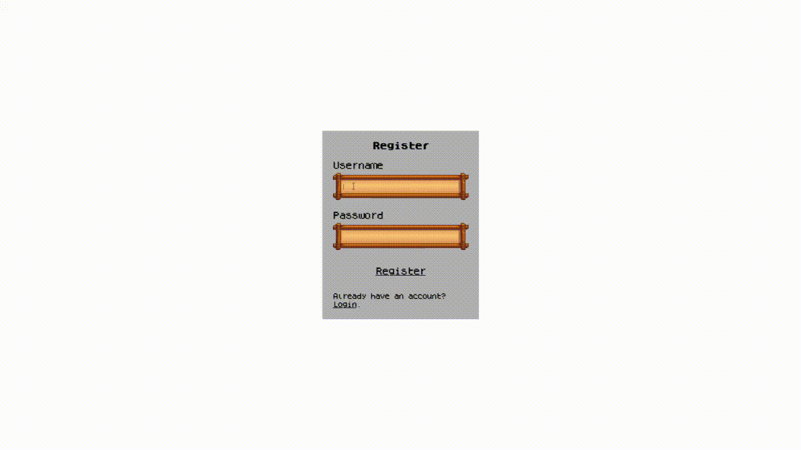
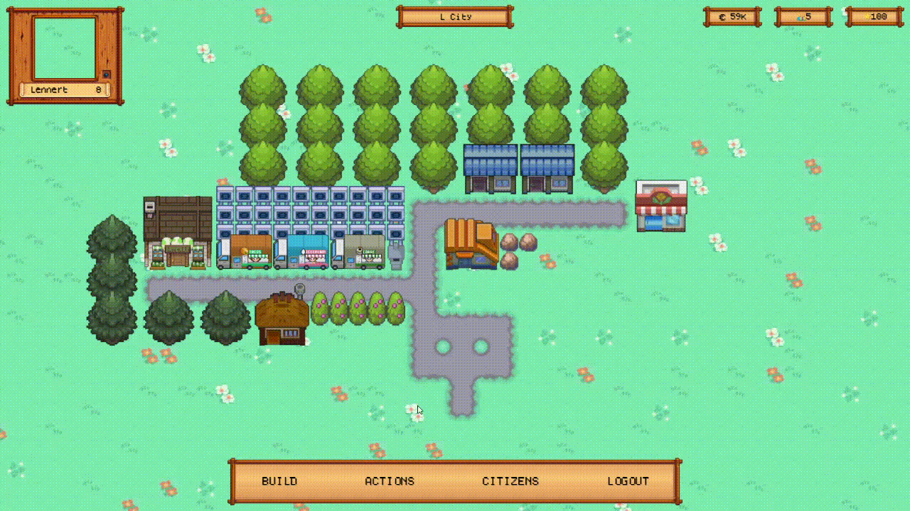
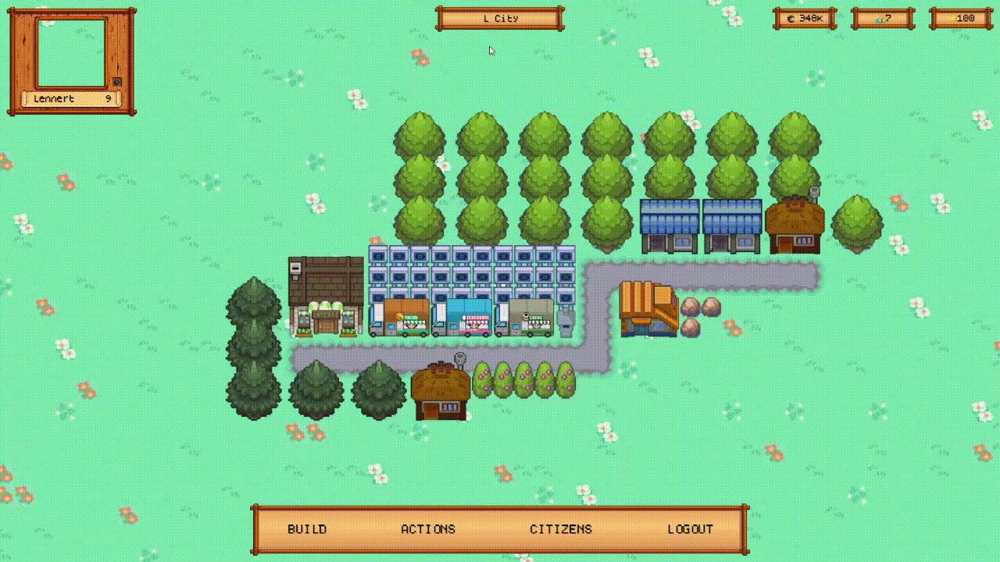
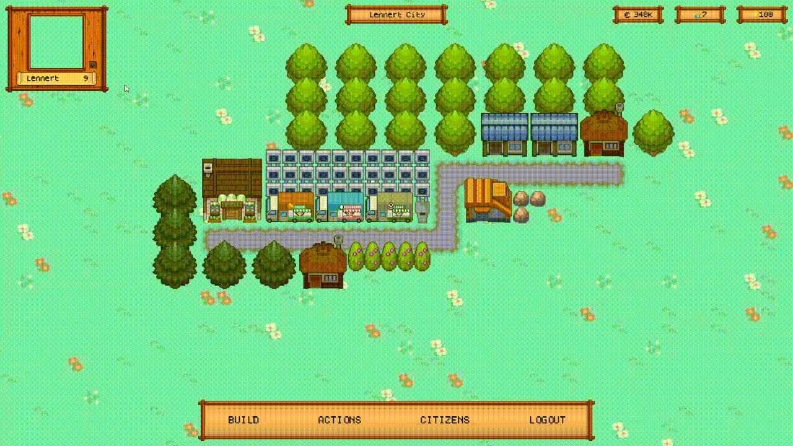

# Game Mechanics

In this document, the game mechanics for Pokemon City are explained to give you a better understanding of the inner workings of the API.

To make the explanation clearer, every mechanic is also summarised in a video of the real browser game.

## Register and login

Registering is safe and your password will be protected with care.

Logging in is only necessary once a month (if you don't log out manually)

After a successful registration or login, you will be redirected to your city.

## Building

To build an object, click the 'build' button in the toolbar and the build menu will pop up. Here you can select which building you want to place down. There are 4 main type of objects that can be placed in the city:

### Houses

Houses are objects that have 2 major goals, providing citizens and collecting rent. Each type of house has different properties. The rent that is collected from the houses is dependent on the satisfaction of the city.

Houses generate rent over a certain period of time. When the stored rent is more than 50% of the maximum amount of rent the house can hold, the player can collect the rent. Rent will accumulate through the time but will stop when the max rent is reached.

### Companies

Companies are objects that provide money over time, without a max amount limit. Their profits can be collected, no matter what amount. It is possible to assign a certain amount of citizens to the company as an employee. This will increase the amount of money this company generates. The amount of profit is dependent on multiple factors:

- Amount of citizens living in the city
- Satisfaction of the city
- The statistics of the employees assigned to this company

Companies have on of four types:

- Cooking
- Selling
- Service
- Social

When you assign a citizen to this company, only this stat of the citizen will influence the profit generated by this company. Also, this stat will increase over time for this citizen (since he/she accumulates work experience). The other stats will decrease.

### Decorations

Decorations are objects that improve the satisfaction in your city. Satisfaction influences the speed that money is generated by houses and companies.

Satisfaction explained:

- Negative satisfaction will lower the speed of money generation
- Neutral satisfaction (0) will give you a normal money generation speed
- Positive satisfaction will increment the speed of money generation

The minimum amount of satisfaction is -100, this will result in -50% profit loss. The maximum is +100 which will result in +200% profit increase.

### Roads

Roads are objects that don't influence anything in the city. They are simply used to connect buildings with each other (which is not an obligation). Roads are free.

It is not possible to move roads.

## Moving and demolishing objects

You're able to move and demolish all previous buildings, except roads, they are not movable. Simply click the actions button in the toolbar and select the move or the demolish button.

There is a small catch though. Remember that houses provide citizens to your city. You cannot have more citizens in your city than your houses can provide. Luckily, citizens are not bound to a house, which means you can delete the citizens with the worst stats that are not employed. The game will recognize when you want to demolish a house and lead you through the selecting process of citizens. There is also a button to automatically select the right amount of citizens that have the worst stats for convenience.

## Citizens

We've talked a lot about citizens already, but what are they? As mentioned before, the are spawned by building houses. The citizens themselves are not bound to the houses, but the number of citizens is bound to the number of citizens all your houses can provide together.

When a citizen is spawned by building a house, it gets a random name and random stats.  These stats are values for each type of company. It gets a random max value (max 100) and an effective value for each of these types.

Citizens assigned to a company will increase profit by the stat value corresponding to the type of that company. Also, this value will increase over time, while the other values drop. This increase happens until the effective value reaches the max value of this citizen.

## Collecting money

To collect the rent of a house or the profit of a company. Just hover over it with your mouse and it will show the current savings. A company can always be collected while a house needs to have generated 50% or more of its maximum.

## Changing city name

To change the name of your city. You click in the box with the city name, type another name and click out of it. The name will be saved now.

## Viewing statistics

To view your statistics, you click on your account box in the hud. This will open you personal player information.

A better way to view your statistics (and the statistics of other players) is by downloading the [Pokemon City Stats](https://github.com/lennertsoffers/Pokemon-City-Stats) app, which is also connected to the same API.

